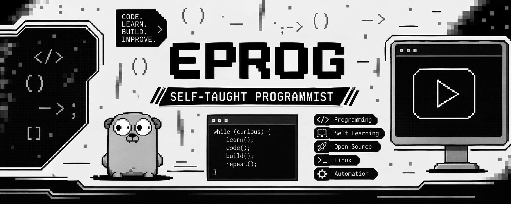
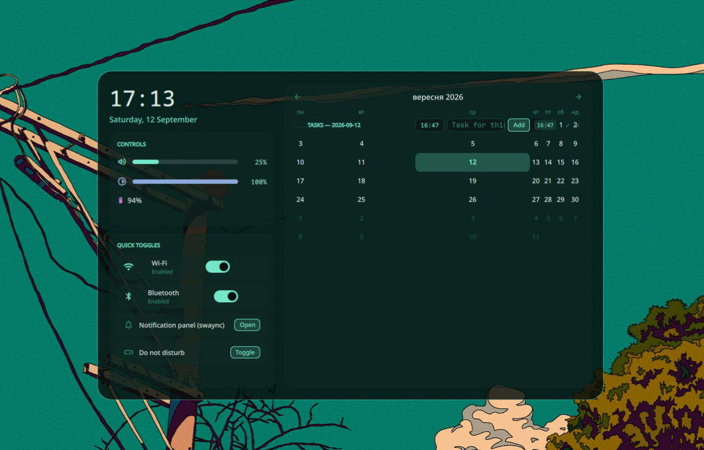

# Edots

Лаконічний та функціональний конфіг для **MangoWM** + **Quickshell**.
**[English version](README.en.md)**



| Dashboard | Notch |
|---|---|
|  |  |

## Фічі

- **Пігулка (Pill)**, що морфить у поверхні: лаунчер, шпалери, медіа, мікшер, буфер обміну, Wi-Fi, Bluetooth/посилання, живлення, налаштування
- **Повноцінне вікно Settings** — централізована система кастомізації:
  - сторінки: Pill, Animations, Bar, Presets, System, About
  - **пошук** по всіх налаштуваннях одночасно
  - кожен контрол має ↺-скидання на заводське значення
  - **пресети**: вбудований immutable Default + користувацькі (create/apply/rename/delete/export/import)
  - усі зміни — живі (без перезапуску), persist у `~/.config/quickshell/settings.json`
- **Dashboard** (Super+D / `qs ipc call dashboard toggle`) — годинник, гучність (Pipewire), яскравість, батарея, швидкі тогли (Wi-Fi/Bluetooth), **swaync** (панель + DND), **календар із тасами на день і час**
- **Task Manager** (`qs ipc call tasks toggle`) — папки з тасами (бекенд `edots/task-manager/core.py`), **utimer** (таймер зі сповіщенням через swaync), **upkg** (пакети через термінал)
- **Blur** — реальний, через `blur_layer`/`blur_params_radius` у конфігі MangoWM (hot-reload)
- **Animations everywhere** — глобальний тумблер + множник швидкості (`Anim.ms`)
- Модульна система hover-бара: видимість і порядок модулів з UI
- Позиція панелі top/bottom
- swaync, swaylock-effects, rofi, nm-applet

## Структура

```
quickshell/
├── bar/                    # головний shell
│   ├── shell.qml, PillShell.qml
│   ├── Config.qml Defaults.qml Presets.qml   # система налаштувань
│   ├── Anim.qml CompositorFx.qml SettingsSearch.qml TasksStore.qml
│   └── settings/           # Settings UI + Dashboard + Task Manager (plain-файли)
├── test-implementions/     # експерименти (Task Manager портовано у бар)
mango/                      # binds.conf, swayidle.conf, scripts/wallcolors.py, config.conf (blur)
edots/                      # CLI-утиліти: task-manager/, tool-manager/ (utimer, upkg), settings.edot
swaync/ rofi/ kitty/ ...
```

## Вимоги

Quickshell (з Io/Wayland/Services/Networking), MangoWM, SF Pro Display/SF Mono/Material Symbols Rounded/JetBrainsMono Nerd Font, `brightnessctl`, `nmcli`, `rfkill`, `swaync-client`, `kitty`, `awww`, `matugen`, `cliphist`, `python3`.

## Встановлення

```sh
git clone https://github.com/Edgit13/Edots-rice ~/Edots-rice
cd ~/Edots-rice && ./install.sh   # або ./sync.sh для повторної синхронізації
qs -p ~/.config/quickshell/bar/shell.qml
```

## Ключові бінди (mango/binds.conf)

`Super+Space` launcher · `Super+C` wallpaper · `Super+V` clipboard · `Super+W` wifi · `Super+X` mixer · `Super+O` power · `Super+A` settings · `Super+D` dashboard · `Super+Esc` закрити

## IPC

```sh
qs -p ~/.config/quickshell/bar/shell.qml ipc call pill toggleLauncher
qs -p ~/.config/quickshell/bar/shell.qml ipc call settingsapp toggle
qs -p ~/.config/quickshell/bar/shell.qml ipc call dashboard toggle
qs -p ~/.config/quickshell/bar/shell.qml ipc call tasks toggle
```
