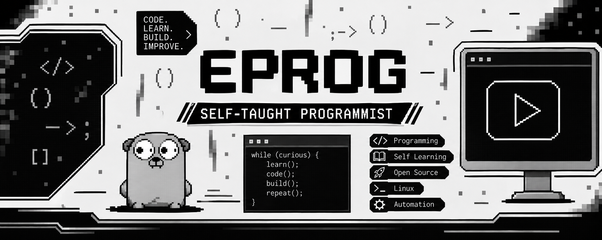
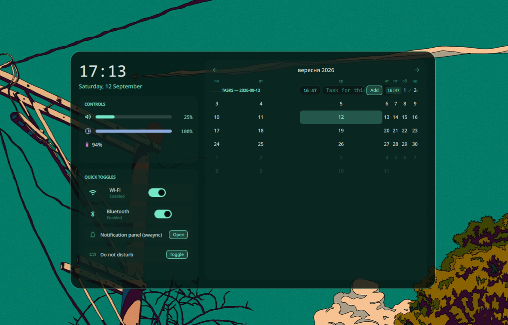

# Edots

Лаконічний та функціональний rice для **MangoWM** + **Quickshell**.
**[English version](README.en.md)**



| Dashboard | Lock screen |
|---|---|
|  |  |

## Фічі

### Оболонка (Quickshell)
- **Material 3 bar** — пігулка, що морфить у поверхні: launcher, шпалери, media,
  mixer, clipboard, Wi-Fi, живлення, нотифікації, settings
- **Dashboard** (Super+D) — clock, volume (Pipewire), brightness, battery,
  швидкі тогли, swaync, календар
- **Task Manager** (Super+T) — папки з тасами (backend `edots/task-manager/core.py`),
  `utimer`, `upkg`
- **M3 lock screen** — власний Quickshell-локскрін з парольним полем, animated
  shapes, ken burns, parallax, power menu
- **Material 3 Settings** (Super+A) — окреме вікно з живими контролами:
  - сторінки: Appearance, Colors, Bar, Lock screen, Animations, Presets, System, About
  - **search** по всіх категоріях одночасно
  - кожен контрол має ↺-скидання
  - все live, без перезапуску, persist у `~/.config/quickshell/*.json`
- **Animations everywhere** — глобальний тумблер + множник швидкості
- **Modules з UI** — видимість/порядок модулів бару з Settings
- **Panel position** top/bottom/left/right

### Кольори
- **wallcolors.py** (matugen) генерує одну палітру з шпалер і роздає її:
  - `~/.config/quickshell/colors.json` → bar, lockscreen, settings
  - `~/.config/{kitty,ghostty,gtk-3.0,gtk-4.0,rofi,swaync,fish}/…`
  - `~/.config/firefox-colors.css`, `~/.config/kdeglobals`, swaylock
- Зміна шпалери → уся система перефарбовується миттєво

### Сесія
- **Lock** (Super+L) — M3 lock screen
- **Suspend** (Super+F3) — lock-then-suspend через logind
- **Idle** — `swayidle` через systemd user service; lock після 5 хв, DPMS off після 10

## Структура

```
quickshell/               # rice runtime
├── bar/                  # bar shell
│   ├── shell.qml         # entry
│   ├── Config.qml Defaults.qml Presets.qml  # settings backend
│   ├── Anim.qml Colors.qml Md.qml
│   ├── dashboard/        # Dashboard widgets (weather, media, performance, …)
│   ├── modules/          # per-monitor bar modules (clock, volume, workspaces, …)
│   ├── services/         # MangoService, WifiService, WeatherService, ClockSettings, PerformanceService
│   ├── shell/            # BarWindow, MorphSurface, ShellState, SurfaceOverlay
│   ├── theme/            # Theme tokens (ThemeColors, ThemeTypography, ThemeMotion, …)
│   └── tools/            # mango-probe.sh
├── lockscreen/           # M3 lock screen + pam-auth + systemd hooks
│   ├── shell.qml         # entry
│   ├── pam-auth.c        # PAM helper (compiled by install.sh)
│   ├── lock.sh           # launch script
│   ├── suspend.sh        # lock → suspend
│   └── logind-watch.sh   # reacts to logind LockSession
├── material/             # shared M3 component library (M3.qml, MaterialButton, …)
├── settings/             # standalone Settings UI
│   ├── shell.qml         # entry (qs -p)
│   ├── SettingsApp.qml   # sidebar + router
│   ├── SettingsState.qml # single source of truth, writes JSON
│   ├── controls/         # RowSwitch, RowSlider, RowDropdown, RowColor, …
│   ├── pages/            # PageAppearance, PageColors, PageBar, PageLockscreen, …
│   └── material/         # copy of the shared M3 library
└── scripts/              # gamemode.sh, modernmode.sh, pilldesign.sh

mango/                    # MangoWM config
├── config.conf           # sources the fragments below
├── binds.conf            # keybindings
├── autostart.conf        # exec-once list
├── animations.conf decorations.conf env.conf input.conf layout.conf monitors.conf rules.conf
├── swayidle.conf         # idle hooks
├── colors.json           # live palette (generated)
├── swaylock/colors.conf  # generated
└── scripts/
    ├── wallcolors.py     # the palette pipeline
    ├── lock.sh           # legacy swaylock wrapper
    └── swaylock-*.sh     # legacy swaylock widgets

edots/                    # CLI ecosystem
├── bin/edot-i18.py       # settings.edot parser
├── task-manager/core.py  # folder-based tasks
├── tui-player/           # TUI + daemon music player (MPRIS-over-socket)
├── tool-manager/         # upkg, utimer
├── asettings.sh          # settings.edot bootstrapper
└── run.sh autostart.sh update.sh backup.sh

systemd/                  # user units (symlinked by sync.sh)
├── swayidle.service
└── edots-lockscreen.service

fish/ ghostty/ kitty/ gtk-3.0/ gtk-4.0/ firefox/ rofi/ swaync/ nvim/
                          # app configs, all themed by wallcolors.py
install.sh                # bootstrap
sync.sh                   # symlink manager
```

## Вимоги

- **Quickshell** (з Io/Wayland/Services/Networking/UPower/Pipewire/Mpris)
- **MangoWM** (mangowc-git)
- Шрифти: `SF Pro Display` (пропрієтарний, опційно), `SF Mono`, `JetBrainsMono
  Nerd Font`, `Material Symbols Rounded`, `Google Sans Flex`
- Ключові бінарники: `matugen`, `awww`, `cliphist`, `swaync-client`, `brightnessctl`,
  `nmcli`, `rfkill`, `playerctl`, `grim`, `tesseract`, `python3`, `jq`
- Для lockscreen: `gcc`, `pam` headers; `pam-auth` компілюється install.sh

## Встановлення

```sh
git clone https://github.com/Edgit13/Edots-rice ~/Dotfiles
cd ~/Dotfiles && ./install.sh
# перелогінитись (щоб fish/swayidle/systemd підхопили оточення)
```

Що робить `install.sh`:
1. Клонує репо і `Edot-Wallpapers` (у `~/Pictures/Wallpapers`).
2. Ставить пакети з pacman + AUR (`yay` бутстрапиться автоматично).
3. Ставить Google Sans Flex.
4. Запускає `./sync.sh install` — лінкує конфіги в `~/.config`.
5. Реєструє й запускає systemd user services (`swayidle`, `edots-lockscreen`).
6. Компілює `lockscreen/pam-auth`.
7. Генерує початкову палітру з першої шпалери.

Після встановлення:
```sh
qs -p ~/.config/quickshell/bar/shell.qml
```

`install.sh` підтримує `--auto` для NixOS-bootstrap та Arch без питань.

## Keybinds (mango/binds.conf)

| Бінд | Дія |
|---|---|
| `Super+Space` | Launcher |
| `Super+C` | Wallpapers |
| `Super+V` | Clipboard |
| `Super+W` | Wi-Fi |
| `Super+X` | Mixer |
| `Super+O` | Power menu |
| `Super+A` | Settings |
| `Super+D` | Dashboard |
| `Super+T` | Tasks |
| `Super+U` | QuickSnip (screen capture) |
| `Super+L` | Lock (M3 lock screen) |
| `Super+F3` | Suspend (lock → suspend) |
| `Super+Esc` | Close surface |
| `Super+B` / `Super+E` | Firefox / Files |

## IPC

```sh
qs -p ~/.config/quickshell/bar/shell.qml ipc call pill toggleLauncher
qs -p ~/.config/quickshell/bar/shell.qml ipc call pill toggleWallpaper
qs -p ~/.config/quickshell/bar/shell.qml ipc call pill toggleClipboard
qs -p ~/.config/quickshell/bar/shell.qml ipc call pill toggleMixer
qs -p ~/.config/quickshell/bar/shell.qml ipc call pill toggleWifi
qs -p ~/.config/quickshell/bar/shell.qml ipc call pill togglePower
qs -p ~/.config/quickshell/bar/shell.qml ipc call dashboard toggle
qs -p ~/.config/quickshell/bar/shell.qml ipc call tasks toggle
qs -p ~/.config/quickshell/bar/shell.qml ipc call settings-launch toggle
```

Settings shell — окремий процес:
```sh
qs ipc call settingsapp toggle
```

## Кольорова система

Одна палітра — багато споживачів. `wallcolors.py` (matugen + власні
HSL-правила) пише:

| Файл | Споживач |
|---|---|
| `~/.config/quickshell/colors.json` | bar, lockscreen, settings |
| `~/.config/quickshell/dock-colors.json` | dock |
| `~/.config/mango/colors.json` | бар (дублікат) |
| `~/.config/mango/swaylock/colors.conf` | swaylock (legacy) |
| `~/.config/{kitty,ghostty}/*-colors.conf` | термінали |
| `~/.config/gtk-{3.0,4.0}/gtk-colors.css` | GTK |
| `~/.config/firefox-colors.css` | Firefox chrome |
| `~/.config/swaync/colors.css` | сповіщення |
| `~/.config/rofi/colors.rasi` | rofi |
| `~/.config/fish/fish-colors.fish` | fish |
| `~/.config/kdeglobals` | Qt/KDE |

Зміна шпалери → **усе** оновлюється live. Quickshell, GTK, kitty, fish
перефарбовуються без перезапуску (усі через `watchChanges`).

## NixOS

Див. [nix/README.md](nix/README.md) — модулі для NixOS + home-manager
(mango flake, quickshell, capture stack).

## Ліцензія

MIT.
